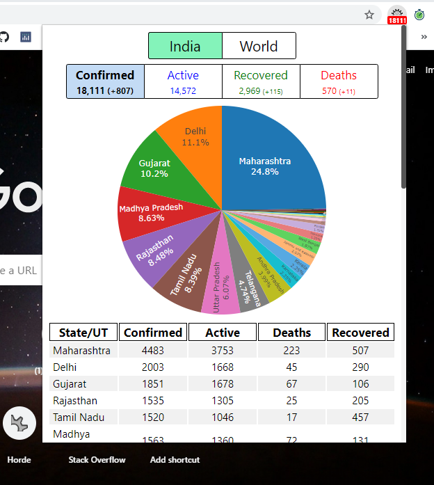

## COVID-19 Tracker
#### _A chrome/firefox extension to quickly track the latest statistics regarding the Coronavirus disease._

This extension uses real time statistics from worldmeters (API: https://covid19-docs.chrismichael.now.sh/) and data from https://www.covid19india.org (API: https://api.covid19india.org/) to show coronavirus statistics for India and Worldwide. Current confimed cases in India is shown on extension badge.  

## Installation
### Chrome
The extension is not available is chrome webstore (Sorry didn't wanted to pay $5). So, you have to use this in developer mode. Download this repo then,   
Go to `chrome://extensions` > Enable developer mode > 
Load unpack extension > load this repo folder.  

### Firefox
Go to `about:debugging#/runtime/this-firefox` > Load Temporary Add-on... > Load the `manifest.json`